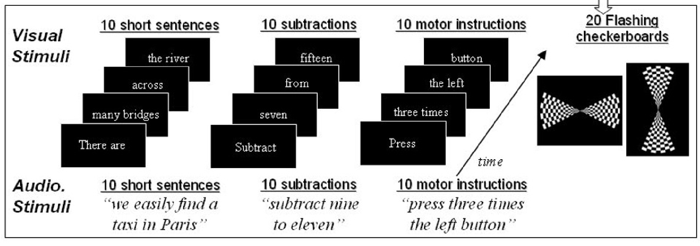
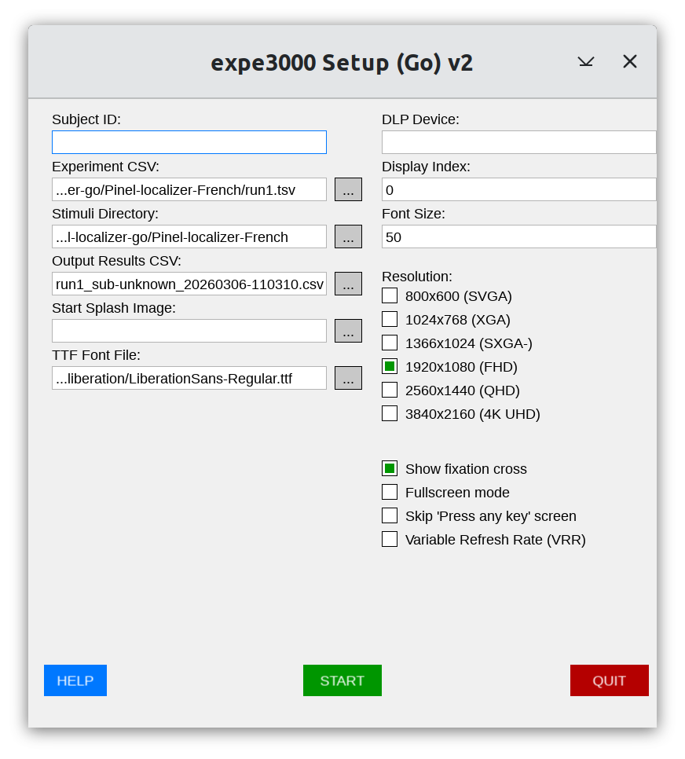

Implementation of the Pinel localizer in Go
-------------------------------------------

[HTML version](https://chrplr.github.io/Pinel-localizer-go) | [Github repo](https://github.com/chrplr/Pinel-localizer-go)

*Note: This has not been thouroughly tested, please report Issues on the github repo if you encounter any*

This is an implementation of the *Pinel functional localizer* stimulation program described in the following publication:

> Pinel, P., Thirion, B., Meriaux, S., Jobert, A., Serres, J., Le Bihan, D., Poline, J.-B., & Dehaene, S. (2007). Fast reproducible identification and large-scale databasing of individual functional cognitive networks. BMC Neurosci, 8, 91. https://doi.org/10.1186/1471-2202-8-91

This is a port to [expe3000-go](https://chrplr.github.io/expe3000-go) of a Python version available at <https://github.com/chrplr/pinel_localizer>



## Prerequisites 

* Install [expe3000-go](https://chrplr.github.io/expe3000-go) (if you build it from source, make sure to apply the step "*Making the commands available from anywhere*").

## Usage

You can either:

* Execute one of the scripts `run*` from the command line, e.g.

   ```bash
   $ cd Pinel-localizer-French
   $ . run_instructions.sh
   $ . run1.sh
   $ . run2.sh
   ...
   ``` 


* or launch the GUI app `expe3000-gui` and select one of the `.tsv` files inside the subfolders and set the stimuli folder. This is how the interface should look like:



   You can then press the "Start button".`


# License & Authorship


Author: Christophe Pallier <christophe@pallier.org> (Web site <http://www.pallier.org>)

The stimuli were designed by Philippe Pinel at the [INSERM U562 "Cognitive Neuroimaging Unit"](http://www.unicog.org)

License: GNU Public License v3


[](http://www.unicog.org)

